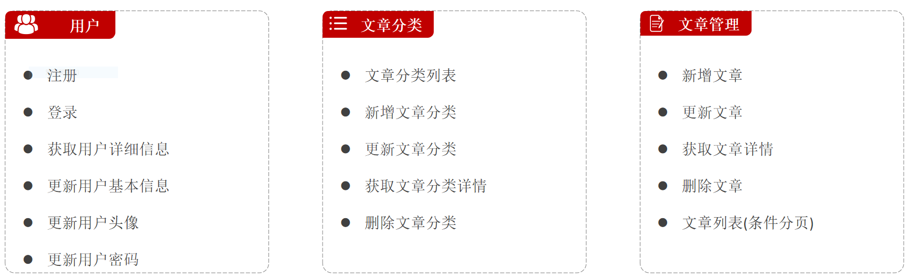

# big-event项目后端代码

[文章管理项目的前端代码](https://github.com/xiaojin03/big-event-vue)

使用了Vue3框架和Elem-Plus组件库进行快速开发。

后端代码使用了SpringBoot架构，MySql数据库，以及Validation、Junit等中间件进行开发。

需要的运行环境：

- JDK17
- MySql 8.0
- Redis

## 后端项目实现的功能

